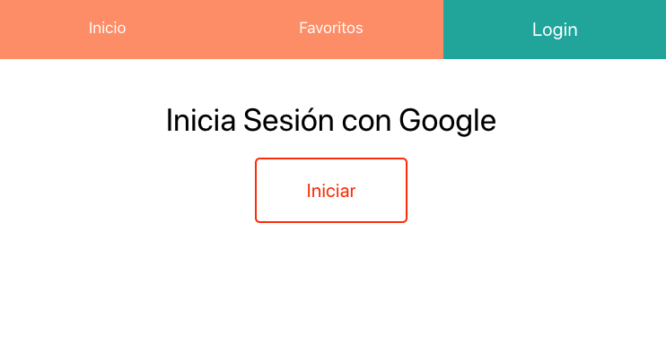
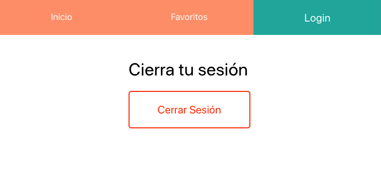
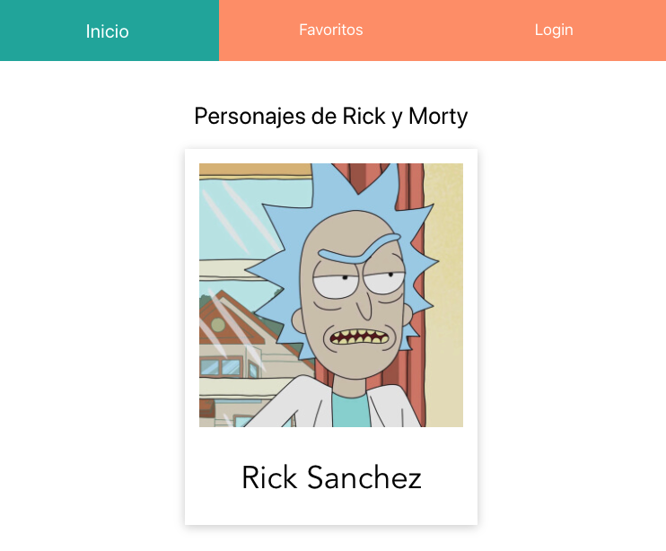
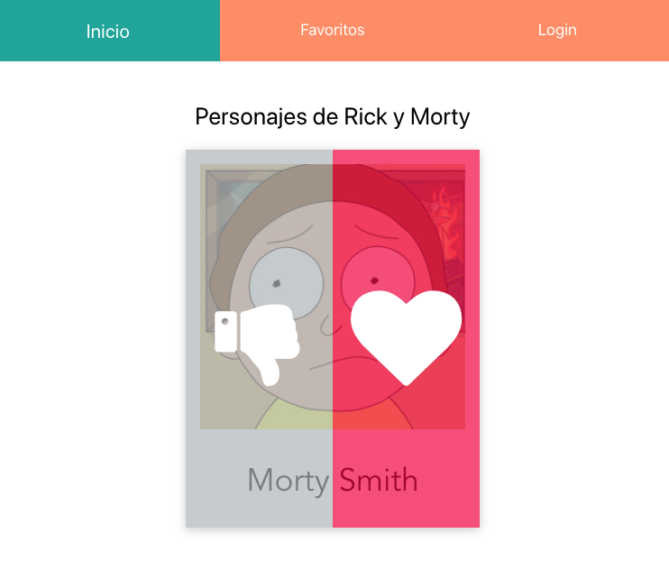

# Rick and Morty API

* [ducks-modular-redux][ducks_modular_redux]
* [redux][redux]
* [react-redux][react_redux]
* [redux-thunk][redux_thunk]
* [redux-devtools][redux_devtools]
* [firebase][firebase]
* [react-apollo][react_apollo]
* [apollo-boost][apollo_boost]
* [graphql][graphql]

[ducks_modular_redux]: https://github.com/erikras/ducks-modular-redux
[redux]: https://redux.js.org/
[react_redux]: https://react-redux.js.org/
[redux_thunk]: https://github.com/reduxjs/redux-thunk
[redux_devtools]: https://github.com/reduxjs/redux-devtools
[firebase]: https://www.npmjs.com/package/firebase
[react_apollo]: https://github.com/apollographql/react-apollo
[apollo_boost]: https://www.npmjs.com/package/apollo-boost
[graphql]: https://www.npmjs.com/package/graphql

## Structure

> run `tree -I "node_modules|public|screenshots|*.css"`

```shell
.
├── Dockerfile
├── README.md
├── docker-compose.yml
├── package.json
├── src
│   ├── App.js
│   ├── App.test.js
│   ├── Routes.js
│   ├── components
│   │   ├── card
│   │   │   └── Card.js
│   │   ├── favs
│   │   │   └── FavPage.js
│   │   ├── home
│   │   │   └── HomePage.js
│   │   └── login
│   │       └── LoginPage.js
│   ├── firebase.js
│   ├── helpers
│   │   ├── index.js
│   │   └── save_storage.helper.js
│   ├── index.js
│   ├── logo.svg
│   ├── redux
│   │   ├── ducks
│   │   │   ├── charsDuck.js
│   │   │   ├── index.js
│   │   │   └── userDuck.js
│   │   ├── index.js
│   │   └── store.js
│   ├── serviceWorker.js
│   └── setupTests.js
└── yarn.lock

9 directories, 24 files
```

## Install

```shell
docker-compose run app yarn add redux react-redux redux-thunk redux-devtools
docker-compose run app yarn add firebase
docker-compose run app yarn add react-apollo apollo-boost graphql
```

## Run Proyect

```shell
docker-compose up
```

## Screenshots

### Signin
<p align="center">
  <kbd>
    
  </kbd>
</p>

### Signout
<p align="center">
  <kbd>
    
  </kbd>
</p>

### Home
<p align="center">
  <kbd>
    
  </kbd>
</p>

### Home with events
<p align="center">
  <kbd>
    
  </kbd>
</p>

